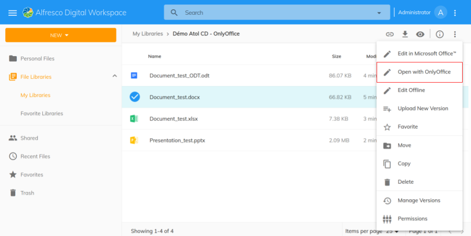
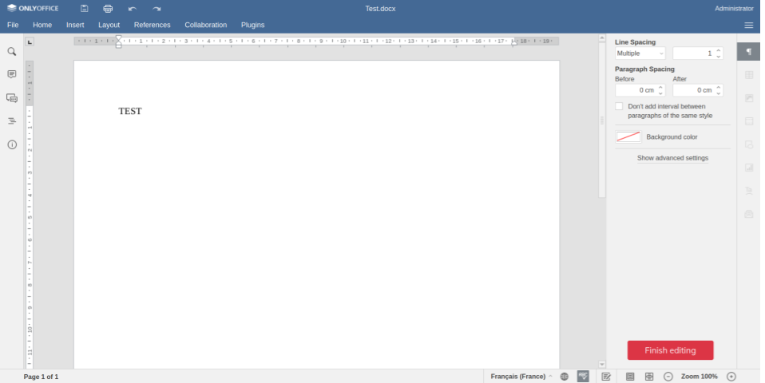
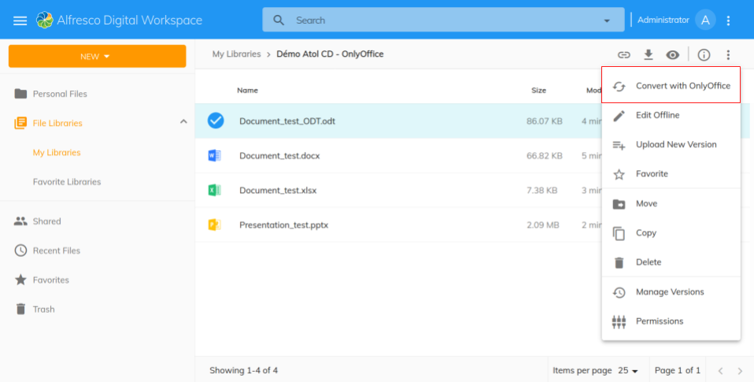

# OnlyOffice Extension - An Alfresco Digital Workspace integration of OnlyOffice for ACS

## Description

The OnlyOffice Extension is a plugin that implements online edition and conversion features from Alfresco OnlyOffice modules to Alfresco Digital Workspace.

## Features

### Online edition



The extension adds a new action button, available both in document actions and details page. The button is only available for documents in Office format(docx, xlsx, pptx, ...)

Please refer to the editor documentation to get all the available supported formats below:
<https://helpcenter.onlyoffice.com/ONLYOFFICE-Editors/ONLYOFFICE-Document-Editor/HelpfulHints/SupportedFormats.aspx>

The document is edited in a custom page.



You can end editing the document by clicking on the red button. The changes will be saved in a new version of the document.

### Conversion

If the edit button is not available, it means that the document is not directly editable. However, the document can be converted if it has one of the following formats:

- LibreOffice formats (odt, odp, ods, ...)
- Old Office version formats (doc, xls, ppt, ...)



When clicking the button, the convert action from the OnlyOffice repository module is called. A copy from the original document is created in an editable format. When the conversion is done, the document list is refreshed, displaying the new document in a editable format.

## Installation

### Prerequisites

You will need an instance of ONLYOFFICE Document Server and Alfresco with the ONLYOFFICE repository module installed. <https://github.com/ONLYOFFICE/onlyoffice-alfresco>
You will also need the ONLYOFFICE module for Alfresco Content Services. The extension is compatible with the version 4.3.0.
You can find the module here <https://github.com/ONLYOFFICE/onlyoffice-alfresco/releases/tag/v4.3.0>.
Please refer to the OnlyOffice website (<https://www.onlyoffice.com/>) to get OnlyOffice solution. The documentation to configure the server is available here: <https://helpcenter.onlyoffice.com/>)"

If you want to build the OnlyOffice extension with ADW, you will need to get the source code for ADW 2.0.0 from Alfresco Support.

Clone the OnlyOffice project. The onlyoffice-extension needs to be placed in /libs in your ADW projects

```sh
git clone https://github.com/atolcd/adf-onlyoffice-extension.git
```

The repository should be named "onlyoffice-extension".

### Configure Alfresco Digital Workspace

We need to configure ADW to register the new extension.

In **angular.json** file, add these lines

```json
{
  ...
 "projects": {
   "content-ee": {
    ...
     "architect": {
       "build": {
         ...
         "options": {
         ...
           "assets": [
             ...
             {
               "glob": "**/*.json",
               "input": "libs/onlyoffice-extension/assets",
               "output": "/assets/plugins"
             },
             {
               "glob": "**/*.json",
               "input": "libs/onlyoffice-extension/assets",
               "output": "/assets/onlyoffice-extension"
             }
...
```

Then, in **angular.json**, add the project "onlyoffice-extension"

```json
{
    "projects": {
        ...
    "onlyoffice-extension": {
      "projectType": "library",
      "root": "libs/onlyoffice-extension",
      "sourceRoot": "libs/onlyoffice-extension/src",
      "prefix": "alfresco-dbp",
      "architect": {
        "lint": {
          "builder": "@angular-devkit/build-angular:tslint",
          "options": {
            "tsConfig": ["libs/onlyoffice-extension/tsconfig.lib.json", "libs/onlyoffice-extension/tsconfig.spec.json"],
            "exclude": ["**/node_modules/**", "!libs/onlyoffice-extension/**/*"]
          }
        },
        "test": {
          "builder": "@nrwl/jest:jest",
          "options": {
            "jestConfig": "libs/onlyoffice-extension/jest.config.js",
            "passWithNoTests": true
          }
        }
      },
      "schematics": {
        "@schematics/angular:component": {
          "style": "scss"
        }
      }
    }
}
```

In **tsconfig.base.json**, add the following path

```json
{
    "paths" : {
        "@atolcd/onlyoffice-extension": ["libs/onlyoffice-extension/src/index.ts"]
    }
}
```

In **nx.json**, add the project
```json
{
"projects": {
    ...
    "onlyoffice-extension": {
        "tags" : []
    }
  },
}
```

Finally, in **extensions.module.ts**, import and add the OnlyOffice module

```typescript
...
import { OnlyofficeExtensionModule } from '@atolcd/onlyoffice-extension';
@NgModule({
 imports: [..., OnlyofficeExtensionModule, ExtensionsOrderExtensionModule,]
})
```

### Build

Run `npm start content-ee` if you want to test the extension locally. You also can build a new application by running `npm run build content-ee` and `npm run build content-ee prod` for production.

### Configure Alfresco Content App

Please notice that you can also build the extension for Alfresco Content App if you don't have access to ADW sources. You will need to modify the angular.json and extensions.module.ts files the same way.

### Configure OnlyOffice extension

Once the extension is properly installed, you’ll need to add your own onlyoffice URL to the app in app.config.json file as following

```json
"onlyOfficeUrl": <your.onlyoffice.installation>
```

## Contributors

Created by Antoine HEITZMANN

Contributors:
- [Alexandre BARBIER](https://github.com/AlexandreBarbier1)

## LICENSE

This extension is licensed under `GNU Library or "Lesser" General Public License (LGPL)`.

## Our company

[Atol Conseils et Développements](http://www.atolcd.com) is Alfresco [Strategic Partner](http://www.alfresco.com/partners/atol)

Follow us on Twitter [@atolcd](https://twitter.com/atolcd)
